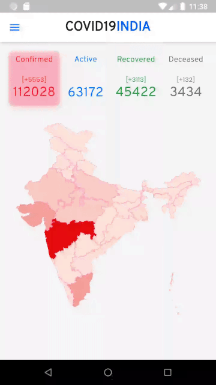

**NOT MAINTAINED ANYMORE**

# Covid 19 India Flutter app

Inspired by https://www.covid19india.org/ which is an [open source](https://github.com/covid19india/covid19india-react) React App.

### Contributions Welcome

If you would like to contribute, please first discuss with me (either as comments on existing issues, or by opening a new issue).

Take a look at [`docs`](docs/) folder for more detailed technical information including Architecture, libraries used, SVG Maps generation and more.

## Screenshots

Here's a gif recording of the home screen. As usual, the quality of the GIF is not really great. [Click here](https://youtu.be/h3p9_ntxgd4) for a better quality WEBM recording on YouTube.




## Running

```bash
flutter packages pub run build_runner build
```

If this command fails, first do

```bash
flutter packages pub upgrade
```

## Downloading

I do not intend to publish this app on any of the stores. I do hope to provide downloadable APKs in the future though.

## Credits

### [Covid19India website](https://www.covid19india.org/)

  - Inspiration 
  - Design
  - Data (backend API)
  - Source code of the Web App (React)
  - Maps of India (TopoJSON format)

### [covidstat.info GraphQL](https://covidstat.info/graphql)

This is a GraphQL wrapper around the covid19india API. It provides a more convenient API for this app

### [Flutter clickable regions Github Repo](https://github.com/gi097/flutter_clickable_regions)

The original React app uses TopoJSON but the only client library available for it is d3.js. The `flutter_clickable_regions` repo shows how to have clickable SVG regions in Flutter. This app uses converts the topojson to SVG using the approach outlined in `flutter_clickable_regions`. 

### [FlatIcon](https://www.flaticon.com/free-icon/virus_2659970)

The app icon is based on an SVG icon that I downloaded for free. Made by Freepik from www.flaticon.com"
