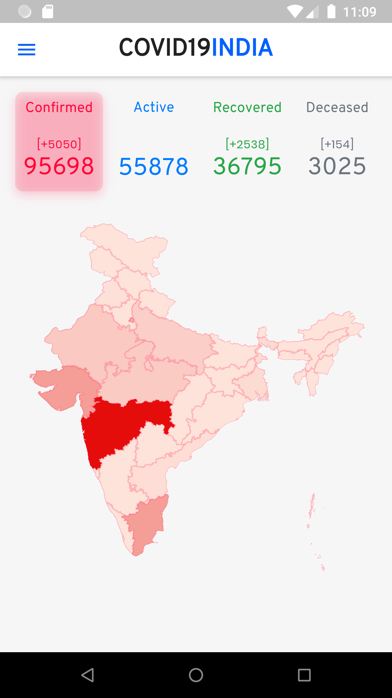

# Covid 19 India Flutter app

Inspired by https://www.covid19india.org/ which is an [open source](https://github.com/covid19india/covid19india-react) React App.

## Screenshots




## Running

```bash
flutter packages pub run build_runner build
```

If this command fails, first do

```bash
flutter packages pub upgrade
```

## Credits

### [Covid19India website](https://www.covid19india.org/)

  - Inspiration 
  - Design
  - Data (backend API)
  - Source code of the Web App (React)
  - Maps of India (TopoJSON format)

### [covidstat.info GraphQL](https://covidstat.info/graphql)

This is a GraphQL wrapper around the covid19india API. It provides a more convenient API for this app

### [Flutter clickable regions Github Repo](https://github.com/gi097/flutter_clickable_regions)

The original React app uses TopoJSON but the only client library available for it is d3.js. The `flutter_clickable_regions` repo shows how to have clickable SVG regions in Flutter. This app uses converts the topojson to SVG using the approach outlined in `flutter_clickable_regions`. 